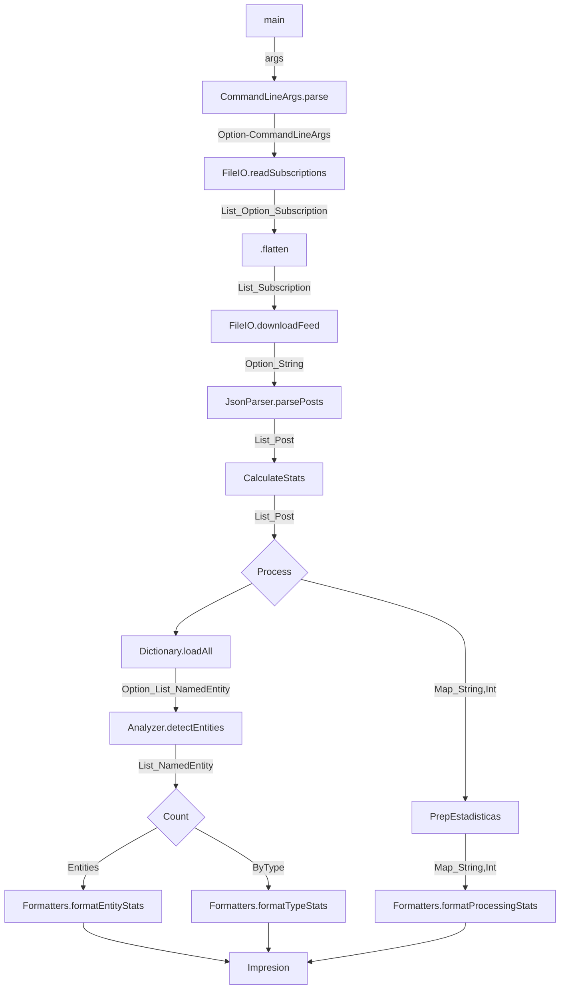

# Grupo 27:
* Aquino, Emir Martin Joel
* Rivadeneira, Patricio Tobias
* Simonian, Fabrizio Joaquin
* Wortley, Tiziano Angel

### Flujo del Programa

### (b)Abstracciones de Spark para cada paso del pipeline
A continuacion se analiza cada componente de nuestro pipeline secuencial anterior y su correspondencia con las abstracciones de Apache Spark para el procesamiento distribuido:

1. **Descarga y Parseo de Feeds:**
-Abstraccion: flatMap

-Justificacion: A partir de un RDD con las URLs de las suscripciones provistas por el Driver, cada Worker toma un link, realiza la peticion HTTP y genera una cantidad variable de elementos (un iterador con N objetos Post validos, o cero si la descarga falla). Al producirse un numero variable de salidas independientes por cada entrada, calza con la definición de flatMap.

2. **Extraccion de Entidades Nombradas (NER):**
-Abstraccion: flatMap

-Justificacion: Cada Post se procesa de forma independiente en los Workers. El analizador recorre el texto y puede encontrar cero, una o multiples entidades (NamedEntity). Como la relacion de transformacion pasa de un elemento a una cantidad variable de salidas, se expresa mediante un flatMap.

3. **Clasificacion y Estructuración de Entidades:**
-Abstraccion: map

-Justificacion: Transforma cada NamedEntity obtenida en exactamente un par clave-valor con la estructura ((tipo, nombre),1).Al ser una transformacion pura de uno a uno donde cada elemento se procesa de forma aislada, corresponde conceptualmente a un map.

4. **Conteo de Entidades:**
-Abstraccion: reduceByKey

-Justificacion: No es posible calcular el total de apariciones de una entidad analizando un unico post de forma aislada. Se requiere agrupar todos los pares distribuidos en el cluster utilizando como clave el par (tipo, nombre) y combinar sus valores (los 1 individuales) mediante una funcion asociativa de suma para consolidar el conteo final en los Workers.

### Pasos del pipeline que no encajan en estas abstracciones ordinarias
-Ordenamiento Global (Ranking): El paso final de ordenar los resultados por conteo descendente y tipo no encaja en las abstracciones basicas de transformacion independiente (map/flatMap) ni en una reduccion asociativa local (reduceByKey).

-Por que: El ordenamiento es una operacion global que rompe la independencia de los Workers. Requiere comparar absolutamente todos los elementos del dataset entre sí para determinar su posicion jerarquica final, lo que implica una redistribucion masiva de los datos a traves de la red (operación de shuffle mediante un ordenamiento global como sortByKey).

# (c)(Pato)

### (d) Restricciones sobre las funciones (Puntos de extensión) en Spark

Para que las funciones anónimas proporcionadas a las transformaciones de Spark (como `map`, `flatMap`, etc.) puedan ejecutarse correctamente en un entorno distribuido, el framework impone restricciones estrictas:

1. **Serialización estricta:** El código de la función y todas las variables u objetos externos que la función captura (el closure) deben ser completamente serializables. Esto se debe a que el *Driver* necesita empaquetar la función y transmitirla a través de la red hacia la memoria de cada uno de los *Workers*. Si la función intenta capturar objetos que no admiten serialización (como conexiones activas a bases de datos, sockets de red abiertos o manejadores de archivos locales), Spark lanzará una excepción antes de iniciar el procesamiento.

2. **Ausencia de estado compartido mutable:** Los *Workers* ejecutan las tareas asignadas en espacios de memoria (JVMs) que están totalmente aislados entre sí. Si una función intenta modificar una variable mutable externa declarada en el *Driver* (por ejemplo, un contador de tipo `var`), cada *Worker* estará alterando únicamente una copia local e independiente de la variable. El programa principal en el *Driver* nunca verá reflejadas estas modificaciones. Para consolidar métricas de forma segura desde los *Workers*, se requiere la utilización de herramientas nativas del framework como los *Accumulators*.

3. **Carencia de efectos secundarios (Funciones Puras):** Spark delega la tolerancia a fallos en el reintento de tareas. Si un nodo de cómputo sufre una caída, Spark simplemente reasigna la ejecución de ese fragmento de datos a otro *Worker* disponible. Debido a esto, la función provista a una transformación de datos podría ejecutarse múltiples veces sobre el mismo input. Por ende, es una restricción indispensable que el comportamiento sea puro e idempotente, evitando efectos secundarios externos no controlados (como escrituras directas en archivos locales o inserciones en bases de datos externas), para no introducir duplicaciones o inconsistencias en el estado global.
