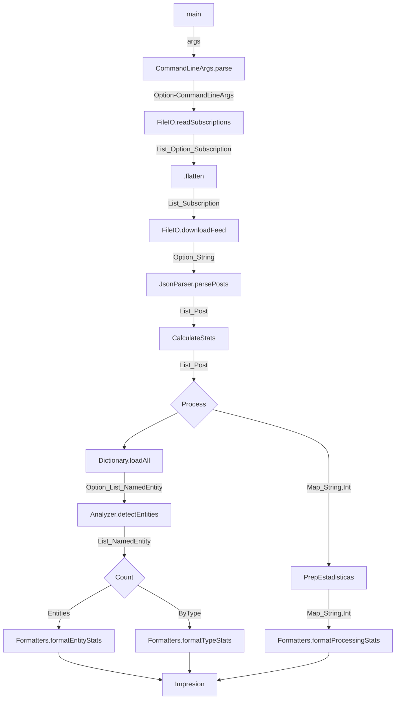
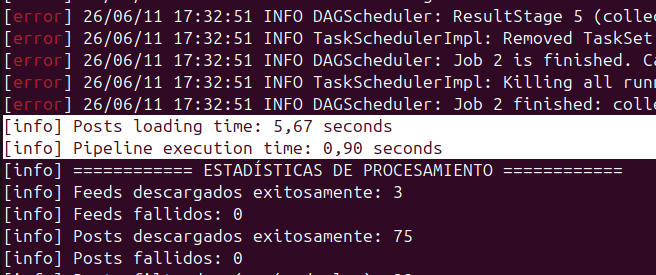
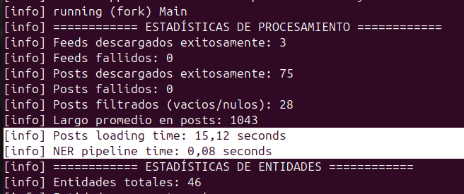

# Grupo 27:
* Aquino, Emir Martin Joel
* Rivadeneira, Patricio Tobias
* Simonian, Fabrizio Joaquin
* Wortley, Tiziano Angel

### Flujo del Programa

### (b)Abstracciones de Spark para cada paso del pipeline
A continuacion se analiza cada componente de nuestro pipeline secuencial anterior y su correspondencia con las abstracciones de Apache Spark para el procesamiento distribuido:

1. **Descarga y Parseo de Feeds:**
-Abstraccion: flatMap

-Justificacion: A partir de un RDD con las URLs de las suscripciones provistas por el Driver, cada Worker toma un link, realiza la peticion HTTP y genera una cantidad variable de elementos (un iterador con N objetos Post validos, o cero si la descarga falla). Al producirse un numero variable de salidas independientes por cada entrada, calza con la definición de flatMap.

2. **Extraccion de Entidades Nombradas (NER):**
-Abstraccion: flatMap

-Justificacion: Cada Post se procesa de forma independiente en los Workers. El analizador recorre el texto y puede encontrar cero, una o multiples entidades (NamedEntity). Como la relacion de transformacion pasa de un elemento a una cantidad variable de salidas, se expresa mediante un flatMap.

3. **Clasificacion y Estructuración de Entidades:**
-Abstraccion: map

-Justificacion: Transforma cada NamedEntity obtenida en exactamente un par clave-valor con la estructura ((tipo, nombre),1).Al ser una transformacion pura de uno a uno donde cada elemento se procesa de forma aislada, corresponde conceptualmente a un map.

4. **Conteo de Entidades:**
-Abstraccion: reduceByKey

-Justificacion: No es posible calcular el total de apariciones de una entidad analizando un unico post de forma aislada. Se requiere agrupar todos los pares distribuidos en el cluster utilizando como clave el par (tipo, nombre) y combinar sus valores (los 1 individuales) mediante una funcion asociativa de suma para consolidar el conteo final en los Workers.

### Pasos del pipeline que no encajan en estas abstracciones ordinarias
-Ordenamiento Global (Ranking): El paso final de ordenar los resultados por conteo descendente y tipo no encaja en las abstracciones basicas de transformacion independiente (map/flatMap) ni en una reduccion asociativa local (reduceByKey).

-Por que: El ordenamiento es una operacion global que rompe la independencia de los Workers. Requiere comparar absolutamente todos los elementos del dataset entre sí para determinar su posicion jerarquica final, lo que implica una redistribucion masiva de los datos a traves de la red (operación de shuffle mediante un ordenamiento global como sortByKey).

# (c)(Pato)

### (d) Restricciones sobre las funciones (Puntos de extensión) en Spark

Para que las funciones anónimas proporcionadas a las transformaciones de Spark (como `map`, `flatMap`, etc.) puedan ejecutarse correctamente en un entorno distribuido, el framework impone restricciones estrictas:

1. **Serialización estricta:** El código de la función y todas las variables u objetos externos que la función captura (el closure) deben ser completamente serializables. Esto se debe a que el *Driver* necesita empaquetar la función y transmitirla a través de la red hacia la memoria de cada uno de los *Workers*. Si la función intenta capturar objetos que no admiten serialización (como conexiones activas a bases de datos, sockets de red abiertos o manejadores de archivos locales), Spark lanzará una excepción antes de iniciar el procesamiento.

2. **Ausencia de estado compartido mutable:** Los *Workers* ejecutan las tareas asignadas en espacios de memoria (JVMs) que están totalmente aislados entre sí. Si una función intenta modificar una variable mutable externa declarada en el *Driver* (por ejemplo, un contador de tipo `var`), cada *Worker* estará alterando únicamente una copia local e independiente de la variable. El programa principal en el *Driver* nunca verá reflejadas estas modificaciones. Para consolidar métricas de forma segura desde los *Workers*, se requiere la utilización de herramientas nativas del framework como los *Accumulators*.

3. **Carencia de efectos secundarios (Funciones Puras):** Spark delega la tolerancia a fallos en el reintento de tareas. Si un nodo de cómputo sufre una caída, Spark simplemente reasigna la ejecución de ese fragmento de datos a otro *Worker* disponible. Debido a esto, la función provista a una transformación de datos podría ejecutarse múltiples veces sobre el mismo input. Por ende, es una restricción indispensable que el comportamiento sea puro e idempotente, evitando efectos secundarios externos no controlados (como escrituras directas en archivos locales o inserciones en bases de datos externas), para no introducir duplicaciones o inconsistencias en el estado global.


## Respuestas del Ejercicio 3

### 1. `reduceByKey` como barrera de sincronización

* **¿Qué ocurre en el cluster en ese punto?**
  `reduceByKey` actua como una barrera de sincronizacion porque introduce una etapa de **Shuffle** (redistribucion). Antes de transferir datos por la red, Spark ejecuta una reduccion local inteligente en cada Worker para achicar el volumen de datos. Sin embargo, para obtener el conteo global final, todas las tuplas que compartan la misma clave exacta `(tipo, nombre)` deben ser enviadas a traves de la red hacia un unico Worker de destino, el cual es asignado mediante una funcion de *Hashing*. Ningun nodo puede avanzar a la siguiente etapa del pipeline (`sortByKey`) hasta que todas las particiones locales hayan terminado de procesarse, transmitido sus datos y completado la reduccion global en los nodos asignados.

* **¿Por que es inevitable para este problema?**
  Es inevitable porque el RDD de entrada (los posts de Reddit) esta particionado y distribuido aleatoriamente en el cluster. Como una misma entidad puede aparecer de forma simultanea en posts procesados por diferentes Workers, es matematicamente imposible calcular el gran total de ocurrencias sin centralizar y unificar los subtotales de esa clave en un mismo espacio de memoria fisica antes de la accion final.

### 2. Restricciones de la funcion pasada a `reduceByKey`

La funcion lambda que se le pasa a `reduceByKey` (en nuestro desarrollo: `(contador1, contador2) => contador1 + contador2`) toma dos valores y devuelve uno del mismo tipo. Para garantizar el determinismo en un entorno distribuido y asincronico, debe cumplir con dos restricciones algebraicas estrictas:

* **Asociatividad $(a + b) + c = a + (b + c)$:** Permite que Spark agrupe y reduzca los valores en cualquier orden jerarquico. Esto es fundamental para que la reducción local (en el Worker) y la reducción global (post-shuffle) produzcan exactamente el mismo resultado final.
* **Conmutatividad $a + b = b + a$:** Permite que Spark procese las tuplas en el orden fisico en que vayan llegando a traves de la red a la memoria del Worker asignado, sin importar cual se emitio primero.

Si la funcion careciera de estas propiedades, el resultado del conteo variaria en cada ejecucion dependiendo netamente de la latencia de la red o del orden de las particiones.

### 3. Lectura del diccionario de entidades

* **¿Dónde se hace la lectura?**
  La lectura fisica del sistema de archivos mediante el metodo `Dictionary.loadAll` se realiza **unicamente en el Driver** (en el hilo principal secuencial de la JVM central).

* **¿Como interactúan el Driver y los Workers?**
  El RDD de posts se particiona y delega de manera normal: a cada particion le corresponde una tarea (*Task*) que se envia a los Workers. Sin embargo, para que los Workers puedan consumir el diccionario dentro del `flatMap` sin saturar la red, el Driver utiliza la optimización **`sc.broadcast(dictionary)`**. 
  
  Spark toma el diccionario completo del Driver y lo distribuye hacia la memoria RAM de cada **Worker** *una sola vez por nodo* utilizando un protocolo eficiente de par a par (P2P tipo Torrent). El Driver no necesita coordinar que partes del diccionario se activan; los Workers son totalmente autonomos. A medida que procesan los textos de sus respectivas particiones, el propio contenido de los posts "activa" las consultas locales al diccionario residente en cache mediante `.value`, evitando la sobrecarga critica de empaquetar y transmitir el diccionario completo adjunto en cada *Task* individual.

## Ejercicio 4 — Monitoreo del éxito de las tareas

### ¿Por qué los Accumulators solo deben usarse para métricas y no para tomar decisiones lógicas dentro de las etapas distribuidas del pipeline? ¿En qué situación un Accumulator puede dar un valor incorrecto?

Los Accumulators deben utilizarse únicamente para métricas porque Spark puede ejecutar una misma tarea más de una vez (por ejemplo, ante un fallo o una recomputación). Por eso, su valor no es adecuado para tomar decisiones lógicas dentro de las transformaciones distribuidas.

En nuestro código los usamos correctamente para contar estadísticas:

```scala
feedsSuccessAcc.add(1)
postsFilteredAcc.add(posts.size - filteredPosts.size)
```

y luego leemos sus valores desde el driver para mostrarlos por pantalla.

Un Accumulator puede dar un valor incorrecto si una tarea se ejecuta dos veces. Por ejemplo, si un worker descarga un feed, ejecuta:

```scala
feedsSuccessAcc.add(1)
```

si luego falla antes de terminar, Spark puede volver a ejecutar la tarea. En ese caso el contador podría incrementarse dos veces para un mismo feed, produciendo un sobreconteo. Por eso los Accumulators son útiles para monitoreo y estadísticas, pero no para controlar el flujo lógico del programa.

---

### ¿En qué momento del pipeline está disponible el valor de un Accumulator para ser leído por el driver?

El valor de un Accumulator está disponible para ser leído por el driver una vez que se ejecuta una acción y las tareas correspondientes han finalizado. Antes de eso, las transformaciones de Spark son *lazy* y todavía no se ejecutó ningún trabajo.

En nuestro código, los acumuladores se actualizan dentro de:

```scala
val postsRDD = subscriptionRDD.flatMap { ... }
```

pero sus valores recién son confiables después de una acción como:

```scala
val totalPosts = postsRDD.count()
```

o

```scala
val sortedResults = countsRDD.collect()
```

Por eso leemos:

```scala
feedsSuccessAcc.value
postsSuccessAcc.value
postsFilteredAcc.value
```

al final del programa, después de que las acciones terminales hayan ejecutado el pipeline. Antes de una acción, los acumuladores todavía pueden valer 0 o no reflejar todo el trabajo realizado.

---

### Comparación de tiempos entre la versión secuencial y la versión con Spark

Utilizando las mismas suscripciones y ejecutando ambas versiones en la misma computadora y bajo la misma conexión de red, se obtuvieron los siguientes tiempos:

| Etapa | Versión Spark | Versión secuencial |
|---------|---------|---------|
| Descarga y carga de posts | 5.67 s | 15.12 s |
| Procesamiento NER | 0.90 s | 0.08 s |
 

La descarga y carga de posts fue considerablemente más rápida con Spark (5.67 s frente a 15.12 s), ya que los feeds se descargan en paralelo utilizando varios workers.

En cambio, el procesamiento NER fue más lento con Spark (0.90 s frente a 0.08 s) debido al overhead propio de la ejecución distribuida, como la planificación de tareas, la serialización de datos y la coordinación entre procesos.

Dado que el volumen de datos procesado es pequeño (75 posts), el costo adicional de Spark supera los beneficios del paralelismo en esta etapa. Por lo tanto, las ventajas de Spark se observan principalmente en tareas de entrada/salida (I/O), mientras que para el procesamiento de entidades en este conjunto de datos no se aprecia una mejora de rendimiento.