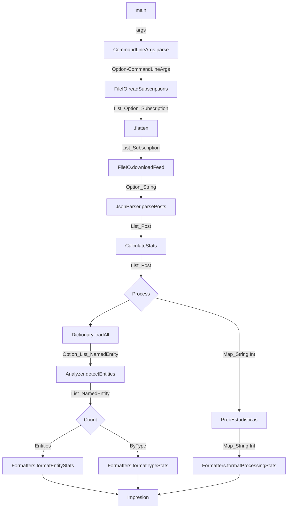

# Grupo 27:
* Aquino, Emir Martin Joel
* Rivadeneira, Patricio Tobias
* Simonian, Fabrizio Joaquin
* Wortley, Tiziano Angel

### Flujo del Programa

# (b)(Tizi)

# (c)(Pato)

### (d) Restricciones sobre las funciones (Puntos de extensión) en Spark

Para que las funciones anónimas proporcionadas a las transformaciones de Spark (como `map`, `flatMap`, etc.) puedan ejecutarse correctamente en un entorno distribuido, el framework impone restricciones estrictas:

1. **Serialización estricta:** El código de la función y todas las variables u objetos externos que la función captura (el closure) deben ser completamente serializables. Esto se debe a que el *Driver* necesita empaquetar la función y transmitirla a través de la red hacia la memoria de cada uno de los *Workers*. Si la función intenta capturar objetos que no admiten serialización (como conexiones activas a bases de datos, sockets de red abiertos o manejadores de archivos locales), Spark lanzará una excepción antes de iniciar el procesamiento.

2. **Ausencia de estado compartido mutable:** Los *Workers* ejecutan las tareas asignadas en espacios de memoria (JVMs) que están totalmente aislados entre sí. Si una función intenta modificar una variable mutable externa declarada en el *Driver* (por ejemplo, un contador de tipo `var`), cada *Worker* estará alterando únicamente una copia local e independiente de la variable. El programa principal en el *Driver* nunca verá reflejadas estas modificaciones. Para consolidar métricas de forma segura desde los *Workers*, se requiere la utilización de herramientas nativas del framework como los *Accumulators*.

3. **Carencia de efectos secundarios (Funciones Puras):** Spark delega la tolerancia a fallos en el reintento de tareas. Si un nodo de cómputo sufre una caída, Spark simplemente reasigna la ejecución de ese fragmento de datos a otro *Worker* disponible. Debido a esto, la función provista a una transformación de datos podría ejecutarse múltiples veces sobre el mismo input. Por ende, es una restricción indispensable que el comportamiento sea puro e idempotente, evitando efectos secundarios externos no controlados (como escrituras directas en archivos locales o inserciones en bases de datos externas), para no introducir duplicaciones o inconsistencias en el estado global.
